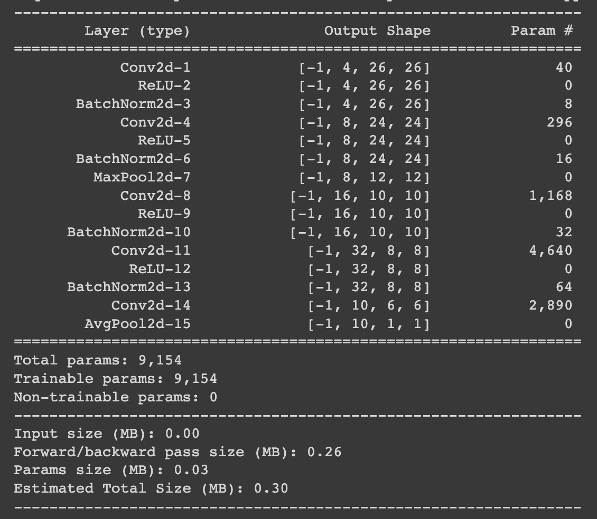

# ERA V1 - Session 6 - Assignment Solution

## Requirements
- 20k parameters or less
- reach 99.4% validation accuracy in less than 20 epochs:

# Obtained Results:
- Parameters: 9,154
- reached 99.17% validation accuracy in 15th epoch

# Approach
## Model Summary

## Model Architecture
- Used Batch norm after every convolution layer
- Used Maxpooling at the end of 1st block 
- Used Average pooling of 6x6 in the last block
- Used 5 convolutional layers with 3x3 kernel size in total
